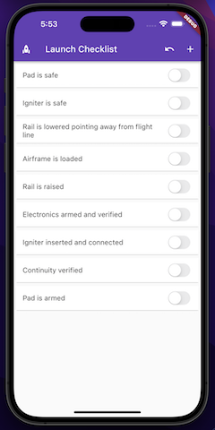

# Go For Launch

This is a simple checklist app built using Flutter aimed at High Power Rocketry hobbyists. With this app you can create the checklists used for launces and not have to carry around a clipboard and pen.

## Getting Started

First, make sure you have Flutter installed and working by following the documentation. 

[Flutter Installation](https://docs.flutter.dev/get-started/install)

Next, keep following the documentation all the way through creating your first app. Once you have the simulator of your choice up and and running with a Flutter app then your environment is good to go.

Last, clone this repo and get hacking.

## Android Build

Check that you have all the pre-reqs you need 

`> flutter doctor`

Build an apk in build/app/outputs/flutter-apk/app-release.apk

`> flutter build apk`

